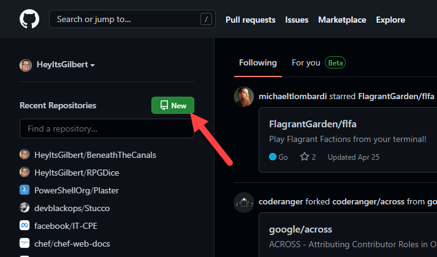

<!--
For Demo I pre-logged into PSGallery & Github
Basic VM with the following configured
- Windows Terminal Preview
- Git
- VS Code w/ following Extensions
-- PowerShell Preview
-- markdownlint
-- Marp for VS Code
-->
<!-- markdownlint-disable MD026 -->

# Stucco: Start to Publish

Creating an open source module in minutes!


---

# Quick Intro

- Gilbert Sanchez
- Señor Systems Engineer at Meta
- Writing PowerShell for the last 10ish years

---

# Agenda

1. Install Modules
2. Setup Our Github Repo
3. Create Our Module
4. Commit
5. Publish

---

# Pre-Requisites

If you want to follow along on your computer here's what you should get ready.

- Github account
- Git installed
- VS Code (Recommended)

---

# Install Stucco!

A good starting point.

```powershell
Install-Module Stucco
```

<!--
Note that it installs it's pre-requisites.
Pester included (which you may need to )
Install-Module Pester -RequiredVersion 5.3.3 -SkipPublisherCheck
-->

---

# Configure Your Github Repository



---

# Create Repo & Check it Out

1. Pick a name, description, etc.
2. Create Repository
3. Check it out!

<!--
A few options...
git clone ...
Github's tool
-->

---

# Create Your Module

```powershell
New-StuccoModule
```

Follow the prompts

---

# Let's Examine

- Repo Layout
- `Requirements.ps1`
- `psakeFile.ps1`
- `Build.ps1`

---

# Build

```powershell
.\build.ps1 -Task Test
```

# Or in VS Code

_Terminal_ -> _Run Task_ -> ___Test___

<!--
Known issue with Windows PowerShell 
https://github.com/psake/PowerShellBuild/pull/60
-->

---

# Commit your code!

```powershell
git add .
git commit -m "Initial commit!"
git push
```

---

# Get Ready for PSGallery

1. Login to [PSGallery](https://www.powershellgallery.com/)
2. Create API keys
3. Copy

---

# Put Your API Key into Github

1. Go to your new repo
2. Settings
3. Secrets -> Actions
4. "PS_GALLERY_KEY" and paste

<!--
Look into branch protection rules
-->

---

# Time to Publish

At this point your code should be ready to publish.

- [Publish.yaml](https://github.com/HeyItsGilbert/RPGDice/blob/main/.github/workflows/publish.yaml)
- [Mkdocs.yaml](https://github.com/HeyItsGilbert/RPGDice/blob/main/.github/workflows/Mkdocs.yaml)

---

# Bonus: Test Results on PR's

1. `$PSBPreference.Test.OutputFormat = 'JUnitXml'`
2. Upload your unit tests via `upload-artifact`
3. Use `EnricoMi/publish-unit-test-result-action@v1`

See [CI.yaml](https://github.com/HeyItsGilbert/RPGDice/blob/main/.github/workflows/CI.yaml)
